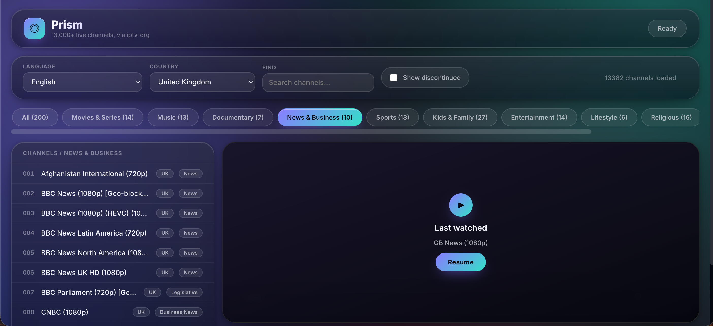

# Prism — Elegant IPTV / M3U Playlist Browser



Prism is a modern, elegant web-based IPTV playlist browser designed to turn large M3U playlists into a clean, easy-to-use live TV experience.

Unlike many IPTV interfaces that look like simple database tables, Prism focuses on a more polished streaming-app style experience with a modern glass interface, smooth navigation, and useful organisation tools.

Prism does **not provide television channels itself**. It is a frontend player that reads IPTV/M3U playlists and presents the available streams in a user-friendly way.

---

## Features

### Modern Interface

* Clean glass-style user interface
* Responsive layout for desktop and touchscreen devices
* Modern typography and animations
* Dark theme designed for media viewing
* Designed to feel more like a streaming application than a technical playlist viewer

### IPTV / M3U Support

* Loads IPTV playlists in standard M3U format
* Supports the public `iptv-org` playlist source
* Uses HLS playback where required
* Works directly in a modern web browser

Default playlist source:

```
https://iptv-org.github.io/iptv/index.m3u
```

---

## Channel Organisation

Prism automatically organises channels using playlist and metadata information.

Features include:

* Language filtering
* Country filtering
* Category filtering
* Channel search
* Channel counts
* Discontinued channel detection
* Channel metadata display

---

## User Preferences

Prism stores user preferences locally in the browser.

Stored settings include:

* Last selected language
* Last selected country
* Show/hide discontinued channels setting
* Last watched channel

This means users can return later and continue from where they left off.

---

## Playback

Prism supports:

* Native browser video playback
* HLS streaming through hls.js
* Safari native HLS support
* Playback error explanations
* Stream availability detection

Where a stream cannot be played, Prism attempts to explain why, such as:

* Stream unavailable
* Playlist error
* Browser compatibility issue
* Stream requiring unsupported headers

---

# Data Source

Prism uses publicly available IPTV metadata and playlist information from the **iptv-org/iptv** project.

The default playlist loaded by Prism is:

```text
https://iptv-org.github.io/iptv/index.m3u
```

The iptv-org project maintains publicly available IPTV channel playlists and related metadata. Prism uses this information to provide a cleaner, more user-friendly viewing interface.

Official iptv-org project:

https://github.com/iptv-org/iptv

The iptv-org project provides additional information about available playlists, metadata, contribution guidelines, and legal information.

---

## How Prism Uses iptv-org Data

Prism reads:

* `index.m3u` — channel playlist information
* `index.language.m3u` — language grouping information
* `channels.csv` — additional channel metadata

The data is processed locally in the user's browser to create:

* searchable channel lists
* language filters
* country filters
* category organisation
* playback controls

Prism does not host, mirror, or redistribute the playlist or any video streams.

The playlist remains provided by the original iptv-org project.

---

# Installation

Prism is a standalone HTML application.

To use:

1. Download `Prism-IPTV.html`
2. Open it in a modern browser
3. Advanced users can replace this URL with their own M3U playlist source within the html page :-

var CATEGORY_PLAYLIST_URL = "https://iptv-org.github.io/iptv/index.m3u"
just paste your playlist in like :-
var CATEGORY_PLAYLIST_URL = "YOUR PLAYLIST HERE"

---

# Legal Notice

Prism is a **playlist browser and media player**.

It does not:

* Host television streams
* Provide IPTV subscriptions
* Supply paid channel access
* Bypass DRM or access controls
* Modify or redistribute broadcast content

Prism simply displays and plays streams from playlists supplied by the user or configured sources.

Users are responsible for ensuring that they have the appropriate rights, permissions, subscriptions, and licences for any content they access.

---

## UK TV Licence Information

If you are located in the United Kingdom, you may need a valid **TV Licence** when using Prism to watch live television broadcasts.

This applies regardless of how the live broadcast is received, including:

* Television sets
* Computers
* Tablets
* Mobile devices
* Internet-based live streams

A TV Licence is generally required when watching or recording live TV channels as they are broadcast.

It is the user's responsibility to ensure they comply with UK TV Licensing requirements.

More information:

https://www.tvlicensing.co.uk/

---

# License

Prism is released under the GNU General Public License v3.0.

This means you are free to:

* Use Prism
* Modify Prism
* Improve Prism
* Share your changes

Any distributed modified versions must also provide their source code under the same GPL license.

Commercial closed-source redistribution is not permitted.

# Disclaimer

Prism is provided as an open-source software project.

The developers of Prism do not operate, control, or guarantee the availability, legality, accuracy, or licensing status of third-party streams contained within external playlists.

Users are responsible for the playlists and content sources they choose to access.

---

# Project Goals

The goal of Prism is simple:

> Create a beautiful, modern IPTV playlist interface that makes large M3U channel lists enjoyable and easy to navigate.

It is intended as a frontend experiment combining web technology, media playback, and modern user interface design.
